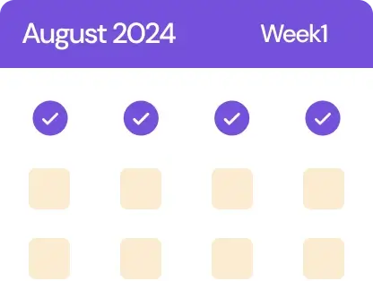
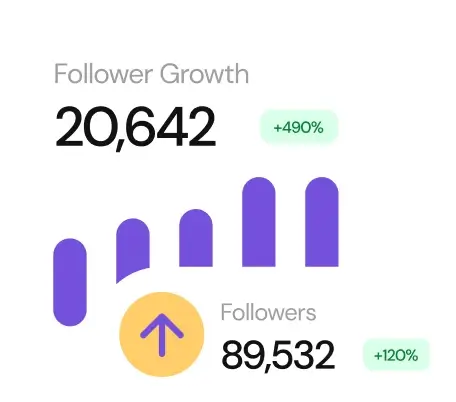

# Frontend Mentor - Bento grid solution

This is a solution to the [Bento grid challenge on Frontend Mentor](https://www.frontendmentor.io/challenges/bento-grid-RMydElrlOj). Frontend Mentor challenges help you improve your coding skills by building realistic projects. 

## Table of contents

- [Overview](#overview)
  - [The challenge](#the-challenge)
  - [Screenshot](#screenshot)
  - [Links](#links)
- [My process](#my-process)
  - [Built with](#built-with)
  - [What I learned](#what-i-learned)
- [Author](#author)

## Overview

### The challenge

Users should be able to:

- View the optimal layout for the interface depending on their device's screen size

### Screenshot


### Links

- 👉 [Solution URL](https://github.com/TheCoder-Rahul/frontend_mentor_bento_grid.git)
- 👉 [Live Site URL](https://thecoder-rahul.github.io/frontend_mentor_bento_grid/)

## My process

### Built with

- 👉 **Markup:** Semantic HTML5 for better accessibility and SEO.
- 👉 **Styling:** CSS3 with Custom Properties (variables) for a maintainable color scheme, font-properties, and different sizes.
- 👉 **Layout:** Flexbox for centering the card and managing the internal alignment.
- 👉 **Workflow:** Mobile-first approach and Responsive Design using Media Queries.

### What I learned

Check my code snippets below:

```html
<main class="grid_wrapper">
  <article>
    <h1>Social Media <span>10x</span> <i>Faster</i> with AI</h1>
    
    <p>Over 4,000 5-star reviews</p>
  </article>
  <article>
    <h2>Manage multiple accounts and platforms.</h2>
    
  </article>
  <article>
    <h2>Maintain a consistent posting schedule.</h2>
    
  </article>
  <article>
    <h2>Schedule to social media.</h2>
    
    <p>Optimize post timings to publish content at the perfect time for your audience.</p>
  </article>
  <article>
    <h2>Grow followers with non-stop content.</h2>
    
  </article>
  <article>
    <h2>>56%<span> faster audience growth</span></h2>
    
  </article>
  <article>
    <h2>Create and schedule content <span>quicker.</span></h2>
    
  </article>
  <article>
    <h2>Write your content using AI.</h2>
    
  </article>
</main>
```
```css
@font-face {
  font-style: normal;
  font-display: swap;
  font-weight: 400 500;
  font-family: 'DM Sans';
  src: url(./assets/fonts/DMSans-VariableFont_opsz\,wght.ttf) format('truetype');
}
@font-face {
  font-style: italic;
  font-display: swap;
  font-weight: 400 500;
  font-family: 'DM Sans';
  src: url(./assets/fonts/DMSans-Italic-VariableFont_opsz\,wght.ttf) format('truetype');
}
:root {
  --fs-lg: 2rem;
  --fs-xl: 2.75rem;
  --fs-md: 1.563rem;
  --fs-regular: 1.125rem;
  --dark: hsl(0, 0%, 7%);
  --white: hsl(0, 0%, 100%);
  --off-white: hsl(0, 0%, 95%);
  --primary: hsl(256, 67%, 59%);
  --secondary: hsl(39, 100%, 71%);
  --primary-light: hsl(254, 88%, 90%);
  --secondary-light: hsl(31, 66%, 93%);
}
@layer reset {
  *, *::before, *::after {
    box-sizing: border-box;
  }
  h1, h2, p {
    margin: 0;
  }
  h1, h2 {
    font-weight: 500;
  }
  img {
    display: block;
    max-width: 100%;
  }
}
@layer base {
  html {
    line-height: 1.2;
    font-family: 'DM Sans', sans-serif;
  }
  body {
    color: var(--black);
    font-size: var(--fs-regular);
    background-color: var(--off-white);

    @media (width > 60rem) {
      display: flex;
      align-items: center;
      justify-content: center;
      height: calc(100vh - 1rem);
    }
  }
  h1, h2 {
    line-height: 0.85;
    color: var(--head-text-color, inherit);
    text-wrap: var(--head-text-wrap, balance);
    letter-spacing: var(--head-letter-space, -1px);
    font-size: var(--head-font-size, var(--fs-md));

    span {
      display: var(--head-span-display, inline);
      color: var(--head-span-text-color, inherit);
      font-size: var(--head-span-font-size, inherit);
      font-style: var(--head-span-font-style, normal);
    }

    @media (width > 60rem) {
      line-height: 1;
    }
  }
}
@layer layout {
  .grid_wrapper {
    gap: 1.75rem;
    display: grid;
    margin-block: 3rem;
    margin-inline: auto;
    max-inline-size: min(60rem, 95%);
    grid-template-areas: "first" "second" "third" "fourth" "fifth" "sixth" "seventh" "last";

    @media (width > 60rem) {
      margin-block: 0;
      grid-template-columns: repeat(4, 1fr);
      grid-template-areas:  "seventh first first fourth" "seventh second third fourth" "last second third fourth" "last sixth fifth fifth";
    }
  }
  article {
    display: grid;
    overflow: clip;
    gap: var(--article-grid-gap, 1rem);
    padding: var(--article-padding, 1.5rem);
    text-align: var(--article-hor-align, start);
    align-items: var(--article-ver-align, start);
    align-content: var(--article-ver-align, start);
    justify-items: var(--article-hor-align, start);
    justify-content: var(--article-hor-align, start);
    color: var(--article-text-color, var(--dark));
    border-radius: var(--article-border-radius, 0.75rem);
    background-color: var(--article-background-color, var(--white));
  }
  article img {
    width: var(--article-img-width, 100%);
    order: var(--article-img-order, inherit);
    max-width: var(--article-img-width, 100%);
  }
  article:first-child {
    grid-area: first;
    --head-letter-space: 0;
    --article-img-width: 75%;
    --article-padding: 2.5rem;
    --article-grid-gap: 0.75rem;
    --article-hor-align: center;
    --head-font-size: var(--fs-xl);
    --article-text-color: var(--white);
    --head-span-text-color: var(--secondary);
    --article-background-color: var(--primary);
    
    h1 {
      margin-block-end: 0.5rem;
    }
    
    @media (width > 60rem) {
      --article-padding: 3rem;
      --article-img-width: 50%;
    }
  }
  article:nth-child(2) {
    grid-area: second;
    --head-text-wrap: wrap;
    --article-img-order: -1;
    --article-padding: 1rem;
    --head-font-size: var(--fs-md);
    --article-text-color: var(--dark);

    @media (width > 60rem) {
      --article-padding: 1.25rem;
      --article-img-width: 150%;
    }
  }
  article:nth-child(3) {
    grid-area: third;
    --article-padding: 1rem;
    --article-img-width: 70%;
    --article-background-color: var(--secondary);
    
    img {
      margin-block-end: -12%;

      @media (width > 60rem) {
        margin-block-end: -50%;
      }
    }

    @media (width > 60rem) {
      --article-padding: inherit;
      --article-img-width: 100%;
    }
  }
  article:nth-child(4) {
    grid-area: fourth;
    padding-block: 2rem;
    text-wrap-style: pretty;
    --article-padding: 1rem;
    --article-grid-gap: 1.5rem;
    --article-hor-align: center;
    --article-background-color: var(--primary-light);

    @media (width > 60rem) {
      --article-img-width: 185%;
      --article-padding: 1.75rem;
      --article-ver-align: center;
      --article-hor-align: start;
    }
  }
  article:nth-child(5) {
    grid-area: fifth;
    padding-inline: 2.5rem;
    --head-text-wrap: wrap;
    --article-img-order: -1;
    --article-img-width: 90%;
    --article-hor-align: center;
    --head-font-size: var(--fs-lg);
    --article-text-color: var(--white);
    --article-background-color: var(--primary);

    @media (width > 60rem) {
      padding-inline: 1.5rem;
      --article-img-width: 100%;
      --article-hor-align: start;
      --article-ver-align: center;
      grid-template-columns: 1fr 1fr;
    }
  }
  article:nth-child(6) {
    grid-area: sixth;
    --head-letter-space: 0;
    --article-img-width: 60%;
    --article-grid-gap: 1.5rem;
    --head-span-display: block;
    --head-font-size: var(--fs-xl);
    --head-span-font-size: var(--fs-regular);

    span {
      margin-block-start: 1rem;
    }

    @media (width > 60rem) {
      --article-img-width: 80%;
      --article-padding: 1.25rem;
    }
  }
  article:nth-child(7) {
    grid-area: seventh;
    --article-img-width: 70%;
    --article-padding: 1.875rem;
    --head-font-size: var(--fs-lg);
    --head-span-font-style: italic;
    --head-span-text-color: var(--primary);
    --article-background-color: var(--secondary-light);

    @media (width > 60rem) {
      --article-padding: 2rem;
      --article-img-width: 100%;
      --article-ver-align: center;
    }
  }
  article:last-child {
    grid-area: last;
    --head-text-wrap: wrap;
    --article-img-width: 75%;
    --article-grid-gap: 1.5rem;
    --head-font-size: var(--fs-lg);
    --article-background-color: var(--secondary);

    @media (width > 60rem) {
      --article-img-width: 100%;
    }
  }
}

@media (width > 60rem) {
  :root {
    --fs-xl: 3.25rem;
    --fs-regular: 1rem;
  }
}

@layer utilities {
  .visually-first {
    order: -1;
  }
}

.attribution {
  font-size: 11px;
  text-align: center;

  @media (width > 60rem) {
    bottom: 0.5rem;
    position: absolute;
  }
}
.attribution a {
  color: hsl(228, 45%, 44%);
}
```

## Author

- 👉 GitHub - [TheCoder-Rahul](https://github.com/TheCoder-Rahul)
- 👉 Frontend Mentor - [@TheCoder-Rahul](https://www.frontendmentor.io/profile/TheCoder-Rahul)
- 👉 LinkedIn - [@Rahul Kumar](https://www.linkedin.com/in/rahul-the-developer/)